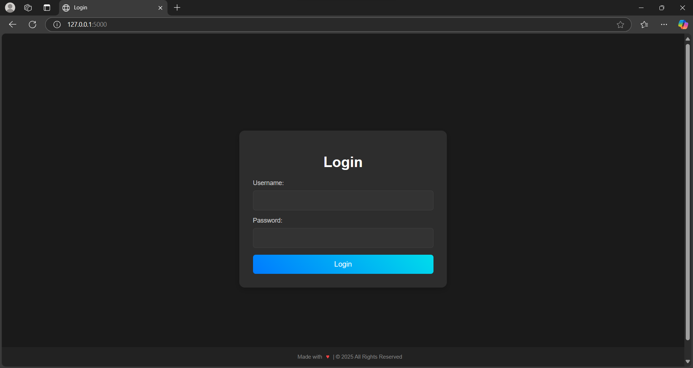
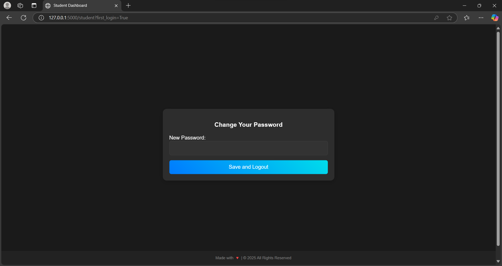
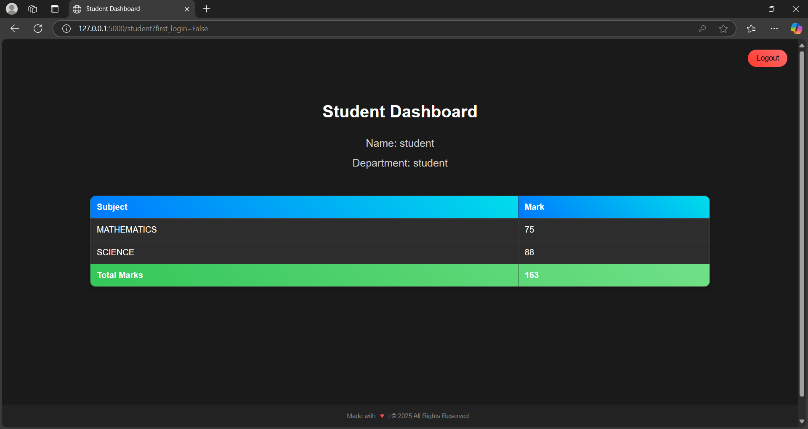
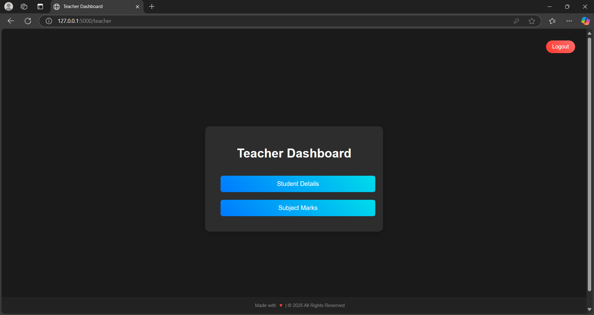
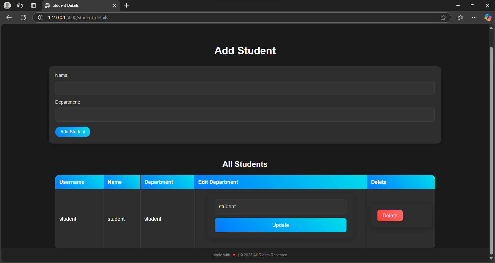
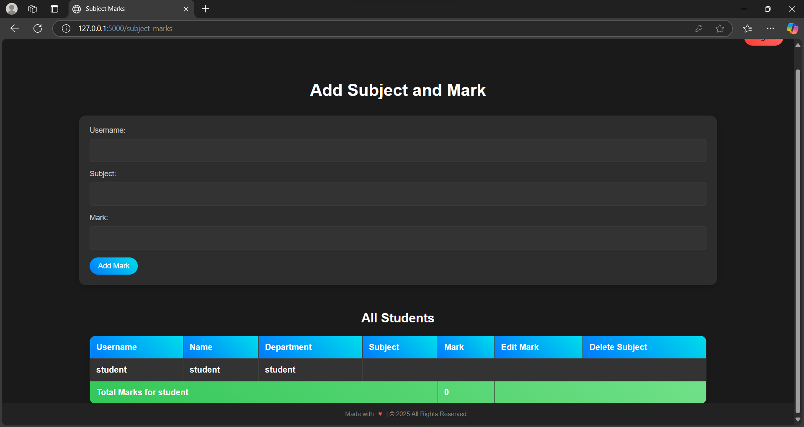

# Student Mark System

A web-based mark adding system for teachers and a mark viewing system for students using Flask and MySQL.

## Features
- Teachers can add student marks.
- Students can view their marks.
- Teachers can create new student logins.
- A student's **first name** will be their **username**.
- Default password is set by the system.
- On first login, students must reset their password.
- After resetting, they are instantly logged out to ensure security.
- MySQL database integration.
- Flask-based web interface.

## Installation
### Prerequisites
Ensure you have the following installed:
- Python 3.x
- MySQL Server
- pip (Python package manager)

### Beginner Setup Guide (Windows + VS Code)
1. **Install MySQL** from [here](https://dev.mysql.com/downloads/installer/).
2. **Open MySQL Command Line Client**.
3. **Create the database**:
   ```sql
   CREATE DATABASE your_database_name;
   ```
4. **Select the database**:
   ```sql
   USE your_database_name;
   ```
5. **Import the database schema**:
   ```sql
   SOURCE C:/path/to/mark_system.sql;
   ```
   _(Example: `SOURCE C:/Users/YourName/Desktop/mark_system.sql;`)_
6. **Open the project folder in VS Code**.
7. **Open the terminal in VS Code**.
8. **Install dependencies**:
   ```sh
   pip install -r requirements.txt
   ```
9. **Run the application**:
   ```sh
   python3 app.py
   ```

## Usage

## Screenshots
Here are some previews of the system:






.png)

.png)

- **Login Page**  
  

- **Teacher Dashboard**  
  

- **Student Dashboard**  
  

- **Student First Login (Password Reset)**  
  

- **Student Details**  
  

- **Add Subject and Marks**  
  

- **Example Data (Add Subject and Marks)**  
  .png)

- **Example Data (Student Details)**  
  .png)

1. **Run the Application**
   ```sh
   python app.py
   ```
2. Open `http://127.0.0.1:5000/` in your browser.

## License
This project is for educational purposes. Modify as needed!

